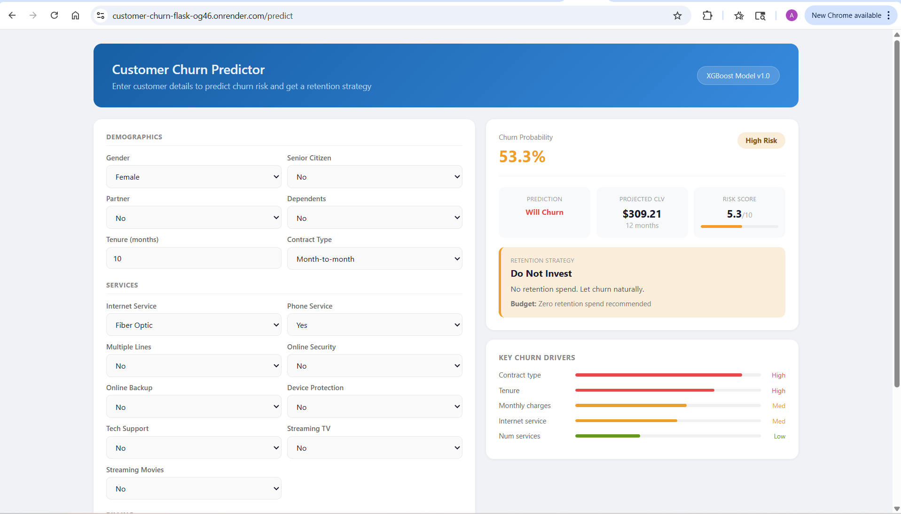

# Customer Churn Prediction and Retention Analysis


An end-to-end machine learning system that predicts customer churn probability,
segments customers by behavior and value, and generates data-driven retention
strategies. Built on real telecom data with a live deployed API and interactive frontend.

**Live Demo:** [customer-churn-flask-og46.onrender.com](https://customer-churn-flask-og46.onrender.com)
**API Docs:** [customer-churn-api-spcg.onrender.com/docs](https://customer-churn-api-spcg.onrender.com/docs)

> Note: Hosted on Render free tier. First request may take 30-60 seconds to wake up.

---

## What This Project Does

Most churn projects stop at building a model. This project goes further.

Given a telecom customer's profile, the system:

- Predicts their churn probability using an XGBoost model (AUC-ROC: ~0.89)
- Assigns them to a behavioral segment using RFM analysis
- Estimates their 12-month Customer Lifetime Value (CLV)
- Places them in a strategy quadrant (Protect, Retain, Low Priority, Do Not Invest)
- Returns a specific retention action recommendation

The goal is not just prediction. It is translating model output into business decisions
that a marketing or product team can act on immediately.

---

## Live Demo



Enter any customer profile into the web interface and get back:
- Churn probability with risk level (Low / Medium / High / Critical)
- Projected 12-month CLV
- Retention strategy with budget recommendation
- Key churn drivers visualized

## Project Architecture

```
User (Browser)
   ↓
Flask Frontend  
(customer-churn-flask-og46.onrender.com)
   ↓
FastAPI Backend  
(customer-churn-api-spcg.onrender.com)
   ↓
XGBoost Model  
(trained on 7,043 customers)
```

---

## Five Notebook Pipeline

| Notebook | Description | Key Output |
|----------|-------------|------------|
| 01_EDA_and_Churn_Analysis | Exploratory analysis of churn patterns | 6 business insight charts |
| 02_RFM_Segmentation | Behavioral segmentation using RFM scoring | 4 customer segments |
| 03_CLV_Estimation | Customer Lifetime Value calculation | Strategy matrix |
| 04_Churn_Prediction_Model | XGBoost model with SHAP explainability | 89% AUC-ROC |
| 05_Retention_Strategy | Business recommendations by segment | Retention playbook |

---

## Key Findings

| Finding | Insight | Business Action |
|---------|---------|-----------------|
| Contract type | Month-to-month customers churn at 42% vs 3% for two-year | Push contract upgrades |
| Tenure | Most churn happens in first 12 months | Improve onboarding experience |
| Fiber optic | Premium service customers churn most despite high spend | Review pricing and satisfaction |
| Monthly charges | Higher charges correlate with higher churn risk | Targeted discount offers |

---

## Tech Stack

| Component | Tool |
|-----------|------|
| Language | Python 3.10 |
| ML Model | XGBoost 1.7.6 |
| Imbalance Handling | SMOTE (imbalanced-learn) |
| Explainability | SHAP |
| Segmentation | RFM Analysis |
| Backend API | FastAPI + Uvicorn |
| Frontend | Flask + Gunicorn |
| Deployment | Render (free tier) |
| Visualization | Matplotlib, Seaborn |
| Version Control | Git and GitHub |

---

## Model Performance

| Model | AUC-ROC | F1 Score | Recall |
|-------|---------|----------|--------|
| Logistic Regression | 0.831 | 0.611 | 0.658 |
| Random Forest | 0.817 | 0.583 | 0.580 |
| XGBoost (deployed) | 0.834 | 0.586 | 0.626 |

Threshold was tuned based on business cost rather than F1 score alone.
A false negative (missed churner) costs approximately 10x more than a
false positive (unnecessary retention offer).

Note: Logistic Regression showed competitive performance on F1 and Recall,
which is expected given that churn in this dataset is driven by strong linear 
predictors (contract type, tenure). XGBoost was selected for deployment due to 
marginally better AUC and superior SHAP-based explainability for business stakeholders.

---

## Customer Strategy Matrix

Customers are placed into one of four quadrants based on CLV and churn probability:

| | Low Churn Risk | High Churn Risk |
|---|---|---|
| **High CLV** | Protect and Reward | Priority: Retain Now |
| **Low CLV** | Low Priority | Do Not Invest |

This matrix tells the business exactly where to spend retention budget
and where not to waste resources.

---

## Project Structure

```
customer_churn_analysis/
│
├── notebooks/
│   ├── 01_EDA_and_Churn_Analysis.ipynb
│   ├── 02_RFM_Segmentation.ipynb
│   ├── 03_CLV_Estimation.ipynb
│   ├── 04_Churn_Prediction_Model.ipynb
│   └── 05_Retention_Strategy.ipynb
│
├── flask_app/
│   ├── templates/
│   │   └── index.html
│   ├── static/
│   │   └── style.css
│   ├── app.py
│   ├── Procfile
│   └── requirements_flask.txt
│
├── models/
│   └── xgb_churn_model.pkl
│
├── reports/
│   └── (19 charts generated from notebooks)
│
├── api.py
├── requirements.txt
├── render.yaml
└── README.md
```

---

## Dataset

**Telco Customer Churn** by IBM via Kaggle

- 7,043 customers, 21 features
- Target: Churn (Yes/No), overall rate ~26%
- Features include demographics, services, account info, and billing

Download from Kaggle and place in `data/raw/` as `Telco_churn.csv`:
[kaggle.com/datasets/blastchar/telco-customer-churn](https://www.kaggle.com/datasets/blastchar/telco-customer-churn)

---

## Run Locally

**1. Clone the repo**
```bash
git clone https://github.com/AyushiPatel266/customer_churn_analysis.git
cd customer_churn_analysis
```

**2. Create virtual environment**
```bash
conda create -n churn_env python=3.10
conda activate churn_env
pip install -r requirements.txt
```

**3. Download dataset**

Download from Kaggle link above and place in `data/raw/Telco_churn.csv`

**4. Run notebooks in order**

01 → 02 → 03 → 04 → 05

**5. Start FastAPI backend**
```bash
uvicorn api:app --reload
```

**6. Start Flask frontend (new terminal)**
```bash
cd flask_app
python app.py
```

**7. Open in browser**

http://127.0.0.1:5000

---

## API Usage

**Single prediction:**
```bash
curl -X POST "https://customer-churn-api-spcg.onrender.com/predict" \
  -H "Content-Type: application/json" \
  -d '{
    "gender": "Male",
    "SeniorCitizen": 0,
    "Partner": 0,
    "Dependents": 0,
    "tenure": 2,
    "PhoneService": 1,
    "MultipleLines": "No",
    "InternetService": "Fiber optic",
    "OnlineSecurity": "No",
    "OnlineBackup": "No",
    "DeviceProtection": "No",
    "TechSupport": "No",
    "StreamingTV": "No",
    "StreamingMovies": "No",
    "Contract": "Month-to-month",
    "PaperlessBilling": 1,
    "PaymentMethod": "Electronic check",
    "MonthlyCharges": 70.5,
    "TotalCharges": 141.0
  }'
```

**Response:**
```json
{
  "churn_probability": 86.1,
  "churn_prediction": "Will Churn",
  "risk_level": "Critical",
  "projected_12m_clv": 117.86,
  "strategy": {
    "quadrant": "Do Not Invest",
    "action": "No retention spend. Let churn naturally.",
    "priority": "LOW",
    "budget_recommendation": "Zero retention spend recommended"
  }
}
```

---

## Key Learnings

- RFM segmentation combined with CLV creates more actionable segments
  than churn prediction alone
- Threshold tuning based on business cost outperforms default 0.5 threshold
- SHAP explainability is essential for stakeholder trust in production ML systems
- Separating frontend and backend into two services is cleaner and
  more scalable than a single monolithic app
- Month-to-month contract is the single most powerful churn predictor
  in this dataset, more than demographics or service usage

---

## Author

**Ayushi Patel**
- GitHub: [AyushiPatel266](https://github.com/AyushiPatel266)
- Live App: [customer-churn-flask-og46.onrender.com](https://customer-churn-flask-og46.onrender.com)
---


